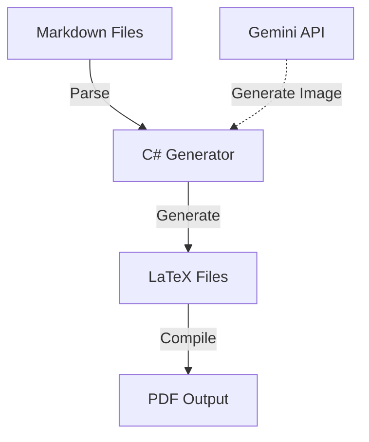

# System Architecture

## Overview
The **RPG Character Generator** is a pipeline that converts raw data (Markdown) into polished documents (PDFs) using immediate mode automation.

## detailed Structure

### 1. The Core (`System/Generator`)
- **Language**: C# (.NET 8.0)
- **Responsibility**: 
    - `MarkdownParser.cs`: Reads and structures data from `.md` files.
    - `ImageGenerator.cs`: Integrates `Mscc.GenerativeAI` to call Google's Imagen model for missing assets.
    - `TexGenerator.cs`: Injects data into LaTeX templates.

### 2. The Templates (`System/Generator/Templates`)
- **Format**: `.tex` (LaTeX)
- **Files**:
    - `template_character.tex`: The full A4 character sheet layout.
    - `template_namesign.tex`: A tent-card style name sign for the table.
- **Customization**: Edit these files to change the visual layout, fonts, or table structures.

### 3. The Automation (`Generate.ps1`)
- **Format**: PowerShell
- **Responsibility**: Orchestrates the build. It handles directory creation, compilation commands, and error reporting.

## Generated Artifacts
- **Intermediate**: `System/Temp/` contains the generated `.tex` files and compilation logs. useful for debugging LaTeX errors.
- **Final**: `Output/` contains the clean PDFs.

[Return to Home](../README.md)
